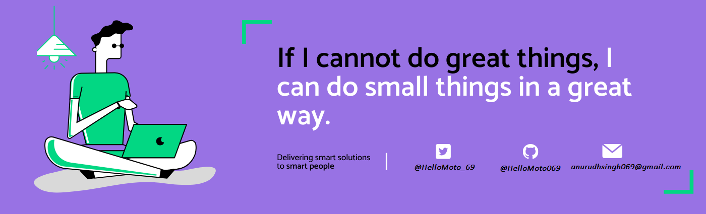

<h1 align="center">Hello I'm Anuruddh Singh </h1> 

<!--
**HelloMoto069/HelloMoto069** is a ✨ _special_ ✨ repository because its `README.md` (this file) appears on your GitHub profile.
Here are some ideas to get you started: -->

  
  

  
 
 -   
     

## 👨🏻‍💻 About Me:

- 🙋‍♂️ All about me is at **[My Website](https://anuruddh-dev.netlify.app/)**

- 🔭 I’m currently working on `Something Intresting`.

- 🌱 I’m currently learning `MERN Stack`

- 👯 I’m looking to collaborate for `Dev Projects`

- 🤔 I’m looking for help with `Competitive Programming`

- 💬 Ask me about anything, Except Maths :sweat_smile:

- 👨‍💻 Life Hack: Learn new tech :fire: and share what you have learned :tada:

- ⚡ Fun fact: I waste most of my time playing games

## 🛠️ Technologies and Tools I use:

 

 
 
 

## ❤️ Let's get connected:

   

## 📊 My GitHub Data:

  
  -   
     
  
  
   
  
   
  

  

  

### ✍️ Random Dev Quote :
 
     
  

     
### 🤣 Random Jokes :

      

  

     
### 🎧 Music Time  :
  
  

    

